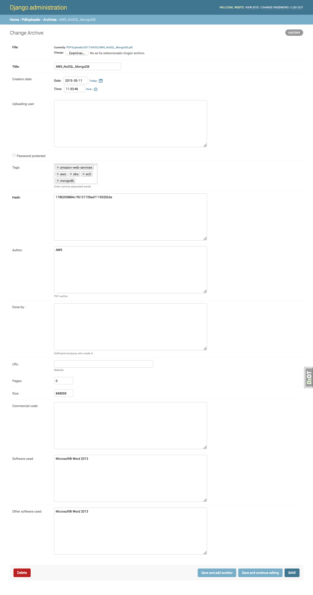

========================
A pdf sorter with Django 
========================

What?
-----

A classifing tool for pdf files.

When a file is uploaded its capable of extracting, if those methadata exist, the following info:

- Title
- Author/s
- Size (bytes)
- If protected by password
- Software used to make the file
- Pages number
- Commercial Code
- Date when it was created
- Date if it was modified
- If there are 'keywords', they will be added as tags

Also after upload, you can add manually:

- URL, a website related with the pdf
- Tags (django-tagulous)

And:

- A hash automatically added when uploaded (md5)

Basic operations can be achieved: upload a file, delete, edit, listing, and detail of each file, plus tags management.
Also some statistics of usage can be viewed.

Finally it is stored at a Postgres database called 'pdfwarehouse'.

Install
-------

SECRET_KEY is not shared, you need to create an env var called DJANGO_SECRET_KEY or the app wont work.

Its recommended to use virtualenv, but not a must::
        
        mkproject <give-a-name>
        
Work on it, only if you did the previous step (virtualenvwrapper is needed)::

        workon <the-name-you-gave>

Versions::

        Python 2.7.X & Django>=1.9

Modules needed::

        pip install -r requirements-dev.txt

        pip install -r requirements-dev.txt         For DEV purposes.
Its mandatory to create a postgres database::

        createdb pdfwarehouse

or::

        /usr/local/pgsql/bin/createdb pdfwarehouse

Launch the website::
        
        python manage.py runserver

Visit this link, you should see the content::

        http://127.0.0.1:8000

Access the admin at::

        http://127.0.0.1:8000/admin

Where a root user is needed, create one with::

        python manage.py createsuperuser

Run tests::

        tox

Screenshots
----------

An edit view:

.. image:: ./DOCS/screenshots/EditView.png

List view with all uploaded files:

.. image:: ./DOCS/screenshots/listView.png

A detail view screenshot of an uploaded file:

.. image:: ./DOCS/screenshots/EditPDFDetailView.png

The site offers an admin backoffice for administrative tasks such us users, permissions,
management of tasks or uploaded files. Following up an example of the view of
an uploaded file:

Main stack
----------

* Django_
.. _Django: https://www.djangoproject.com/
* Cookiecutter-django_
.. _Cookiecutter-django: https://github.com/pydanny/cookiecutter-django
* Django-tagulous_
.. _Django-tagulous:  https://github.com/radiac/django-tagulous
* Chardet_
.. _Chardet: https://github.com/chardet/chardet
* Pdfminer_
.. _Pdfminer: https://pypi.python.org/pypi/pdfminer/
* PostgreSQL_
.. _PostgreSQL: https://www.postgresql.org.es/
* Bootstrap_ 4.0.1
.. _Bootstrap: https://getbootstrap.com/

TODOS
-----

- Full compatibility with Python3.X
- Tests, tests and tests -> there is a "tests branch" and Tox enabled.
- It could be extended to use dropbox, owncloud, etc.
- Some not-unicode, not-latin might make the unicode detection fail.
- A second version will generate API REST. Its installed but not used.
- All-auth is installed, it could be used.
- User app is intalled but not ussed (it's opened as an issue as well)
- Changing the settings an external hard drive could be used.
- Bulk upload, right now its designed to scrap a file at a time.
- Docker?
